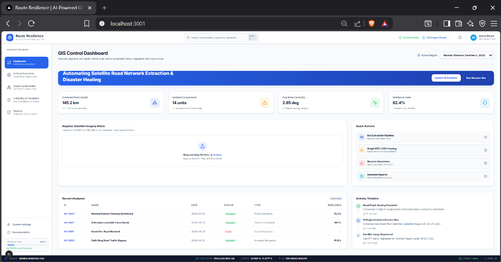
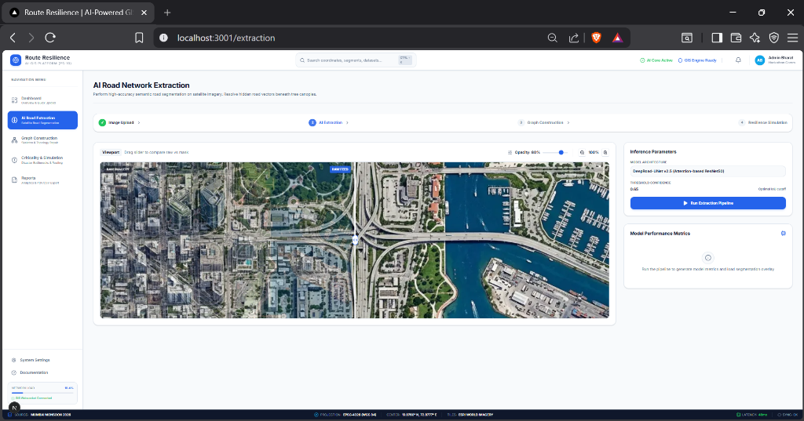
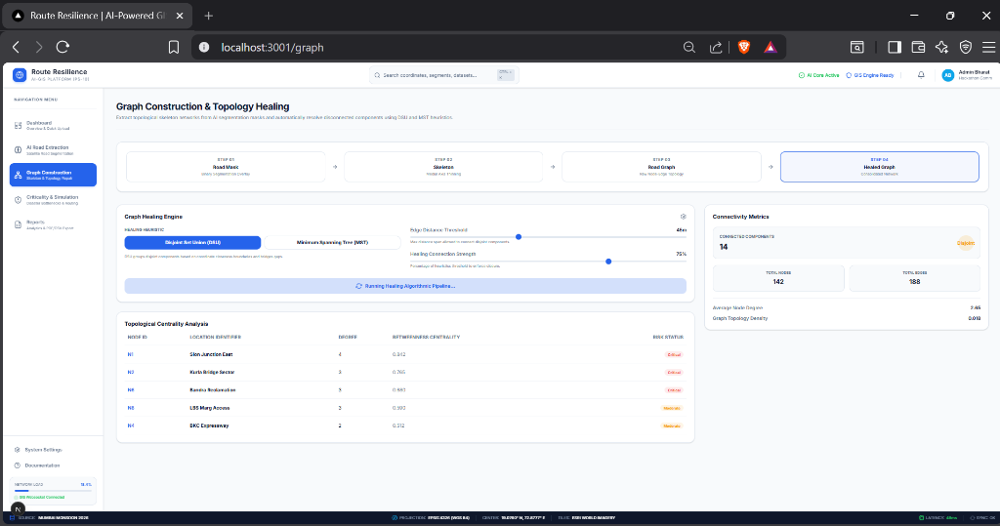
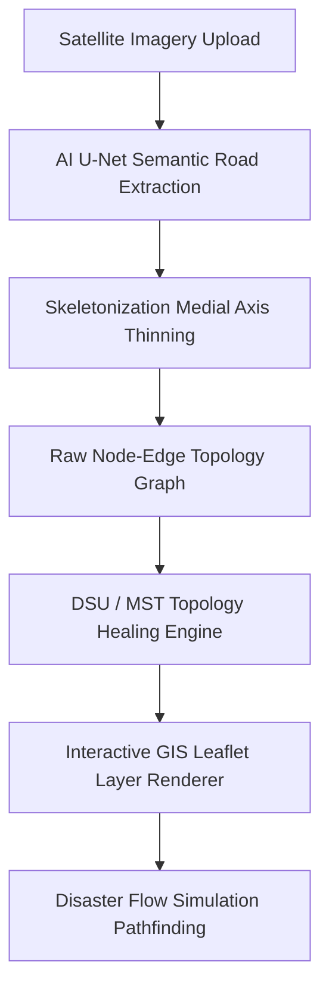

# 🌐 Route Resilience — AI-Powered GIS Platform

<div align="center">
  
  
  
  
  
</div>

---

## 📖 Project Overview

**Route Resilience** is an enterprise-grade geospatial intelligence (GIS) platform developed for the **Antariksh Bharat Hackathon (PS-10)**. The platform solves a critical national security and disaster response challenge: **extracting roads hidden beneath satellite occlusions (heavy forest canopy, clouds, shadows) and modeling road network structural resilience under disaster flows.**

### 🎯 Mission & Vision
*   **Mission**: Provide disaster response squads (NDMA, SDRF) and urban planners with real-time, AI-reconstructed road network graphs to calculate alternative bypasses within seconds of disaster impact.
*   **Vision**: Build an autonomous national geospatial pipeline combining multi-spectral satellite imagery and topological graph theories to ensure zero-delay connectivity routing during national crises.

### ⚠️ Problem Statement
Satellite imagery frequently suffers from cloud coverage, shadow blockages, and thick tree canopies, creating gaps in extracted road networks. Traditional shortest-path routing algorithms fail when edge links in a graph are severed by floods, landslides, or metro construction, leading to critical bottlenecks and isolated regions.

### 💡 The Solution
Route Resilience combines:
1.  **AI Road Segmentation**: Generates road masks using deep learning (U-Net architectures).
2.  **Topological Graph Construction**: Thins masks into 1-pixel skeletons to extract graph node-edge objects.
3.  **Topology Healing Heuristics**: Automatically bridges disjoint segment components using Disjoint Set Union (DSU) and Minimum Spanning Tree (MST) algorithms.
4.  **Disaster Simulation Engine**: Performs flow simulations (Floods, Closures, Accidents) to identify high-centrality bottleneck intersections, calculate delay factors, and render alternative routes dynamically.

---

## 🖥️ Screenshots Gallery

### 1. GIS Control Dashboard
The main command center features dataset registration, real-time KPI metrics, Quick Action links, recent analyses logs, and a live activity feed.


### 2. AI Road Extraction
Side-by-side comparison slider revealing raw satellite imagery vs semantic road network masks, accompanied by deep learning model evaluation metrics (IoU, Dice).


### 3. Graph Construction & Topology Healing
Consolidate disconnected subgraphs by tuning edge connection distance thresholds and selecting DSU vs MST heuristics.


### 4. Disaster Simulation & Bottleneck Inspector
Interactive Leaflet GIS map with dynamic flood circles, alternative bypass routing, and Recharts graphs illustrating travel delay trends.


### 5. Analytical Reports & Exports
Print-ready PDF report briefs and data exporters for GeoJSON vector layouts and CSV matrices.


---

## 🏗️ Architecture & Data Flow



*   **Frontend**: Next.js 15 App Router structured for fluid client-side rendering.
*   **State Management**: Zustand global store synchronizing dataset states, slider positions, and simulation outputs.
*   **GIS Engine**: React Leaflet utilizing Esri World Imagery tiles and WGS 84 (EPSG:4326) projection coordinate tracking.
*   **AI Integration**: Pre-structured REST endpoints ready to connect with FastAPI, PyTorch (segmentation), and NetworkX (graph topology).

---

## 🛠️ Technology Stack

| Category | Technology | Description |
|---|---|---|
| **Core Framework** | Next.js 15 (App Router), React 19, TypeScript | Serverless routing & strict type safety |
| **Styling** | Tailwind CSS v4, Lucide React, Framer Motion | Modern GIS aesthetics and dark mode palettes |
| **Maps & GIS** | Leaflet, React Leaflet, Esri World Imagery | Geodetic geocoding & coordinate tracker |
| **Charts** | Recharts | SVG Travel Delay & Bottleneck Centrality graphs |
| **State** | Zustand | Global application state management |
| **Data & Tables** | TanStack Table | Structural analysis logging |

---

## 📂 Folder Structure

```text
route-resilience/
├── docs/                      # Extensive system documentation
│   ├── Architecture.md        # Technical data flows & layouts
│   ├── API.md                 # Serverless endpoints specifications
│   ├── Development.md         # Guide to local environment setups
│   └── Deployment.md          # Docker & Vercel deployment setups
├── public/                    # Static assets & screenshots
│   ├── screenshots/           # Gallery screenshots
│   └── images/                # Raw satellite imagery assets
├── src/
│   ├── app/                   # Next.js App Router directories
│   │   ├── api/               # Serverless Mock API routes (/upload, /segment, /heal, /simulate)
│   │   ├── extraction/        # Screen 2: AI Road Extraction Slider
│   │   ├── graph/             # Screen 3: DSU/MST Graph Healing
│   │   ├── simulation/        # Screen 4: Disaster Pathfinding & Maps
│   │   └── reports/           # Screen 5: PDF printing & data exports
│   ├── components/            # Reusable UI component modules
│   │   ├── layout/            # Navbar, Sidebar, StatusBar
│   │   └── maps/              # Dynamic Leaflet GIS map container
│   ├── store/                 # Zustand store containers
│   └── lib/                   # Utility helpers (clsx, tailwind-merge)
```

---

## 🚀 Getting Started

### Prerequisites
*   Node.js `v18.x` or higher
*   npm or pnpm

### Installation
1.  Clone the repository:
    ```bash
    git clone git@github.com:Piyushrai05/route-resilience-kryptonite.git
    cd route-resilience-kryptonite
    ```
2.  Install dependencies:
    ```bash
    npm install
    ```
3.  Launch local development server:
    ```bash
    npm run dev
    ```
4.  Open [http://localhost:3001](http://localhost:3001) in your browser.

### Docker Container Setup
```bash
docker build -t route-resilience:latest .
docker run -p 3000:3000 route-resilience:latest
```

---

## 📈 Roadmap

- `[x]` **Phase 1**: Recreate high-fidelity dashboard mockups and unified layouts.
- `[x]` **Phase 2**: Integrate Leaflet GIS maps, satellite layers, and distance measure tools.
- `[x]` **Phase 3**: Develop AI Comparison Slider, graph healing controllers, and simulation charts.
- `[ ]` **Phase 4**: Replace Next.js mock API routers with live FastAPI endpoints (U-Net segmentation, NetworkX pathfinding).
- `[ ]` **Phase 5**: Enable WebSockets streaming to render node-by-node extraction status in real-time.

---

## 🤝 Contributing

Contributions are what make the open-source community such an amazing place. Please review our [Contributing Guidelines](CONTRIBUTING.md) and [Code of Conduct](CODE_OF_CONDUCT.md) before submitting Pull Requests.

---

## 📄 License

Distributed under the MIT License. See [LICENSE](LICENSE) for more details.

---

## 📧 Contact

**Piyush Rai**
*   **GitHub**: [Piyushrai05](https://github.com/Piyushrai05)
*   **LinkedIn**: [Piyush Rai](https://www.linkedin.com/in/piyush-rai-9a101b1b1/) (Placeholder)
*   **Email**: [piyushrai09873@gmail.com]

---

<div align="center">
  <sub>Made with ❤️ by <a href="https://github.com/Piyushrai05">Piyush Rai</a> for the Antariksh Bharat Hackathon 2026</sub>
</div>
