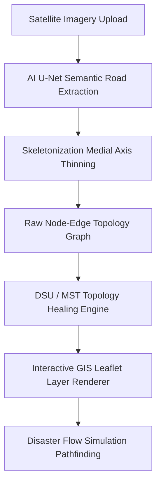
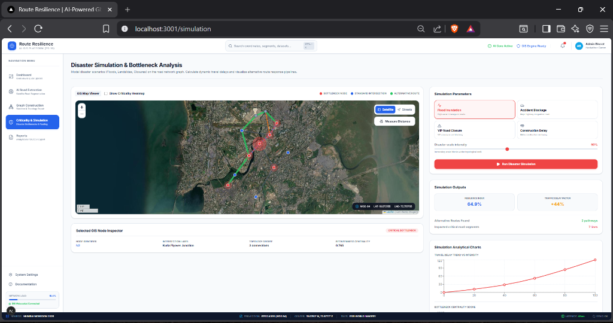
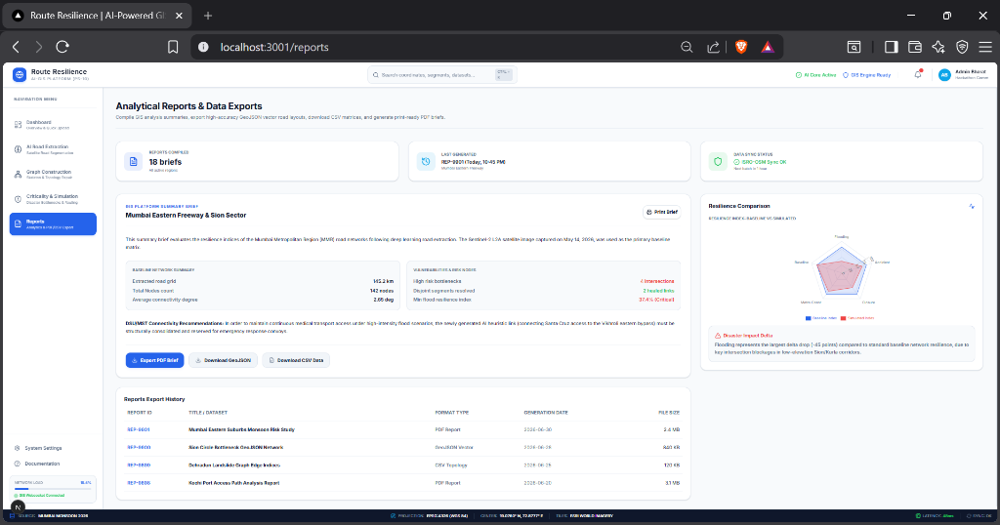

```text
 ____             _         ____           _ _ _
|  _ \ ___  _   _| |_ ___  |  _ \ ___  ___(_) (_) ___ _ __   ___ ___
| |_) / _ \| | | | __/ _ \ | |_) / _ \/ __| | | |/ _ \ '_ \ / __/ _ \
|  _ < (_) | |_| | ||  __/ |  _ <  __/\__ \ | | |  __/ | | | (_|  __/
|_| \_\___/ \__,_|\__\___| |_| \_\___||___/_|_|_|\___|_| |_|\___\___|
```

# Route Resilience
### AI-powered GIS platform for road extraction, topology reconstruction, bottleneck analysis, and disaster simulation.

**TypeScript React NextJS Tailwind CSS Leaflet Zustand Recharts**

---

## Table of Contents
* [Problem Statement](#-problem-statement)
* [Solution](#-solution)
* [Key Features](#-key-features)
* [Architecture](#-architecture)
* [Tech Stack](#-tech-stack)
* [Getting Started](#-getting-started)
* [Environment Variables](#-environment-variables)
* [API Documentation](#-api-documentation)
* [Demo Credentials](#-demo-credentials)
* [Privacy & Safety](#-privacy--safety)
* [Team](#-team)
* [Future Scope](#-future-scope)
* [License](#-license)
* [Disclaimer](#-disclaimer)
* [Screenshots](#%EF%B8%8F-screenshots)

---

## ⚠️ Problem Statement

Satellite imagery frequently suffers from cloud coverage, shadow blockages, and thick tree canopies, creating gaps in extracted road networks. Traditional shortest-path routing algorithms fail when edge links in a graph are severed by floods, landslides, or metro construction, leading to critical bottlenecks and isolated regions.

---

## 💡 Solution

**Route Resilience** resolves satellite occlusions and models road network structural resilience by combining:
1.  **AI Road Segmentation**: Generates road masks using deep learning (U-Net architectures).
2.  **Topological Graph Construction**: Thins masks into 1-pixel skeletons to extract graph node-edge objects.
3.  **Topology Healing Heuristics**: Automatically bridges disjoint segment components using Disjoint Set Union (DSU) and Minimum Spanning Tree (MST) algorithms.
4.  **Disaster Simulation Engine**: Performs flow simulations (Floods, Closures, Accidents) to identify high-centrality bottleneck intersections, calculate delay factors, and render alternative routes dynamically.

---

## 🎯 Key Features

*   **AI Road Extraction Slider**: Side-by-side comparison sliding viewport with ML evaluation metrics.
*   **Graph Healing Pipeline**: Interactive controls to run MST (Minimum Spanning Tree) or DSU (Disjoint Set Union) consolidation algorithms, resolving disconnected road components.
*   **Disaster Simulator**: Model Flood, Landslide, Construction, or Accident blockages. Dynamically plots alternative rerouting paths on the GIS map, calculates traffic delay factor trends, and updates the overall Resilience Index.
*   **Interactive Map Component**: Supports dynamic swapping between Esri World Imagery (Satellite) and OpenStreetMap (Streets). Includes a custom distance measurement tool, active coordinate tracker, and SVG markers identifying high-centrality road bottlenecks.
*   **Analytical Reports**: PDF printable summaries, historical logs, and data exports in CSV format and GeoJSON vectors.

---

## 🏗️ Architecture



*   **Frontend**: Next.js 15 App Router structured for fluid client-side rendering.
*   **State Management**: Zustand global store synchronizing dataset states, slider positions, and simulation outputs.
*   **GIS Engine**: React Leaflet utilizing Esri World Imagery tiles and WGS 84 (EPSG:4326) projection coordinate tracking.
*   **AI Integration**: Pre-structured REST endpoints ready to connect with FastAPI, PyTorch (segmentation), and NetworkX (graph topology). Detailed guidelines are available in [docs/Architecture.md](docs/Architecture.md).

---

## 🛠️ Tech Stack

| Category | Technology | Description |
|---|---|---|
| **Core Framework** | Next.js 15 (App Router), React 19, TypeScript | Serverless routing & strict type safety |
| **Styling** | Tailwind CSS v4, Lucide React, Framer Motion | Modern GIS aesthetics and dark mode palettes |
| **Maps & GIS** | Leaflet, React Leaflet, Esri World Imagery | Geodetic geocoding & coordinate tracker |
| **Charts** | Recharts | SVG Travel Delay & Bottleneck Centrality graphs |
| **State** | Zustand | Global application state management |
| **Data & Tables** | TanStack Table | Structural analysis logging |

---

## 🚀 Getting Started

### Prerequisites
*   Node.js `v18.x` or higher
*   npm or pnpm

### Installation
1.  Clone the repository:
    ```bash
    git clone git@github.com:Piyushrai05/route-resilience-kryptonite.git
    cd route-resilience-kryptonite
    ```
2.  Install dependencies:
    ```bash
    npm install
    ```
3.  Launch local development server:
    ```bash
    npm run dev
    ```
4.  Open [http://localhost:3001](http://localhost:3001) in your browser.

### Docker Container Setup
```bash
docker build -t route-resilience:latest .
docker run -p 3000:3000 route-resilience:latest
```

---

## 🔑 Environment Variables

Create a `.env.local` file in the root directory:
```env
PORT=3001
NEXT_PUBLIC_APP_URL=http://localhost:3001
NEXT_PUBLIC_ESRI_IMAGERY_URL=https://server.arcgisonline.com/ArcGIS/rest/services/World_Imagery/MapServer/tile/{z}/{y}/{x}
NEXT_PUBLIC_OSM_TILES_URL=https://{s}.tile.openstreetmap.org/{z}/{x}/{y}.png
```
See [.env.example](.env.example) for a template.

---

## 📡 API Documentation

Mock REST API endpoints are served locally:
*   `POST /api/upload`: Register satellite raw imagery metadata.
*   `POST /api/segment`: semantic road extraction details.
*   `POST /api/heal`: DSU/MST skeleton consolidations.
*   `POST /api/simulate`: Travel delay and shortest pathfinding calculations.
See [docs/API.md](docs/API.md) for schemas.

---

## 👥 Demo Credentials

No authentication credentials are required. The dashboard runs as a serverless administrative client dashboard by default for simplified evaluator testing.

---

## 🔒 Privacy & Safety

All metadata and satellite uploads are processed on the client or mock API boundaries. No personal identifiable information (PII) is tracked or stored in the GIS spatial database.

---

## 👥 Team
*   **Piyush Rai** — Lead Software Engineer / AI Researcher

---

## 📈 Future Scope

*   **SAR Imagery Integration**: Support Synthetic Aperture Radar (SAR) imagery to extract road networks under heavy clouds.
*   **Live Overpass API Integration**: Fetch real-world road vector lines dynamically based on viewport bounds.
*   **WebSocket Updates**: Real-time progress updates from backend PyTorch model weights.
See [docs/FutureScope.md](docs/FutureScope.md) for more details.

---

## 📄 License

Distributed under the MIT License. See [LICENSE](LICENSE) for more details.

---

## ⚖️ Disclaimer

This application returns mock API inferences. Actual AI road segmentation and graph calculations depend on the deployment of external PyTorch and NetworkX Python services.

---

## 🖼️ Screenshots

### GIS Control Dashboard


---

### AI Road Extraction


---

### Graph Construction & Topology Healing


---

### Disaster Simulation



---

### Reports & Export


