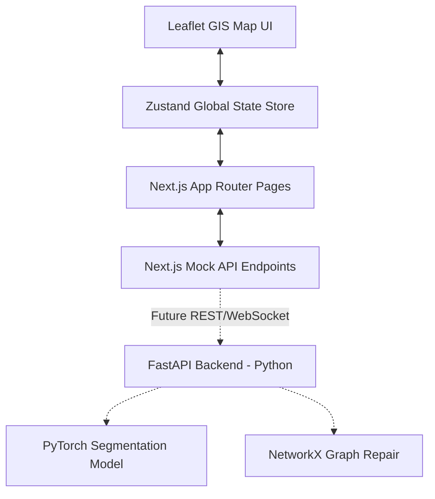

# System Architecture - Route Resilience

This document outlines the software design, folder structure, data flow, and components of the **Route Resilience** platform.

---

## Architecture Overview

Route Resilience is designed as a modular GIS platform structured for future AI model integration:

### 1. Frontend Layer
*   **Next.js 15 (App Router)**: Single Page Layout featuring Navbar, Sidebar, Content workspace, and dynamic status syncing.
*   **Tailwind CSS v4**: Advanced theme variables for slate/blue enterprise layout.
*   **Zustand Store**: Centralized client-state containing active datasets, segmentation parameters, and disaster intensities.

### 2. GIS & Mapping Layer
*   **React Leaflet**: Wraps standard Leaflet map instances for reactive coordinate overlays.
*   **MapLayers**: Toggles between Esri World Imagery (Satellite) and OpenStreetMap (Streets) dynamically.
*   **Custom SVG Overlay**: Dynamically renders road polylines, alternate routes, flood radius circles, and centrality markers without webpack path resolution bugs.

### 3. Serverless API Layer
*   Next.js API Routes (`/src/app/api/*`) mimic production backend microservices:
    *   `/api/upload`: Satellite registration.
    *   `/api/segment`: semantic road extraction details.
    *   `/api/heal`: DSU/MST skeleton consolidations.
    *   `/api/simulate`: Travel delay and shortest pathfinding calculations.

---

## Future Python AI Backend Integration
The codebase is structured to facilitate seamless hot-swapping of Next.js mock handlers for an external FastAPI server:

1.  **FastAPI Endpoint Router**: Routes request parameters directly.
2.  **PyTorch Model worker**: Performs semantic segmentation using a U-Net ResNet50 framework.
3.  **NetworkX Engine**: Constructs network graph objects, calculates degree/betweenness centrality, and heals disconnected components.
